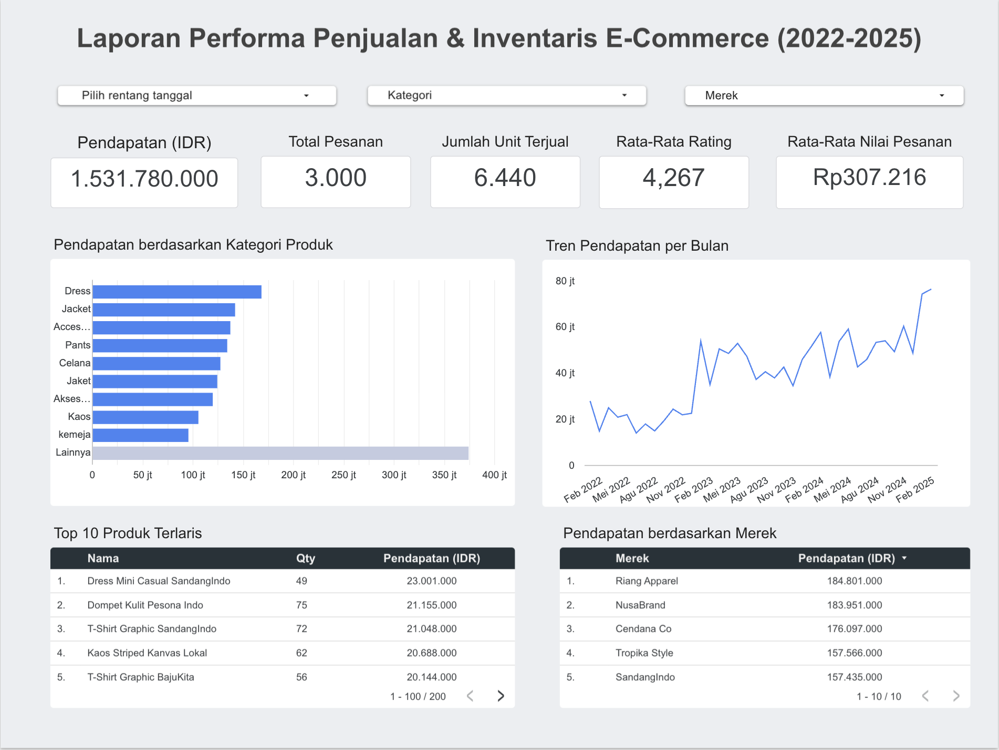

# 📊 Laporan Performa Penjualan & Inventaris E-Commerce (2022-2025)

## 📌 Gambaran Proyek

Proyek ini menganalisis data penjualan dan inventaris e-commerce menggunakan SQL untuk mengidentifikasi kinerja penjualan, produk terlaris, inventaris yang kurang laku, dan memberikan rekomendasi bisnis untuk optimasi inventaris.
## 🔗 Live Interactive Dashboard
👉 [Klik di sini untuk membuka Dashboard Interaktif di Looker Studio]https://datastudio.google.com/reporting/6cd7b636-f09a-4b51-9e73-fe0df273b32a

----

## 🔑 Temuan Utama (Key Insights)
* **Total Pendapatan:** Mencapai **Rp1.531.780.000** dengan total pesanan sebanyak **3.000** transaksi dan **6.440** unit barang terjual.
* **Rata-Rata Nilai Pesanan (AOV):** Berada di angka **Rp307.216** dengan tingkat kepuasan pelanggan yang baik (Rating **4,267**).
* **Kategori Dominan:** Kategori **Dress** mendominasi pendapatan terbesar dibandingkan kategori pakaian lainnya.
* **Produk Terlaris:** **Dress Mini Casual Sandangindo** menjadi produk paling menguntungkan dengan total pendapatan **Rp23.001.000** (49 unit terjual).
* **Merek Teratas:** Merek **Rianji Apparel** memimpin penjualan terbanyak dengan total kontribusi sebesar **Rp184.801.000**.

---

## 💡 Rekomendasi Bisnis (Business Recommendations)
1. **Optimasi Stok (Inventory Management):** Prioritaskan ketersediaan stok untuk kategori *Dress* dan merek *Rianji Apparel* untuk mencegah potensi kehabisan barang (*lost sales*).
2. **Strategi Bundling Promosi:** Buat paket penawaran khusus atau diskon untuk kategori produk yang penjualannya lambat (*slow-moving*) seperti *Kaos* atau *Kemeja* agar perputaran inventaris lebih cepat.
3. **Pertahankan Kualitas:** Menjaga standar produk mengingat *rating* pelanggan sudah tergolong tinggi di angka 4,26.

## 🎯 Masalah Bisnis

Sebagai Analis Data di sebuah perusahaan e-commerce, saya bertugas menganalisis data penjualan dan inventaris untuk mengidentifikasi produk terlaris, produk yang kurang laku, dan memberikan rekomendasi untuk manajemen inventaris yang lebih baik.

---

## 🎯 Tujuan Proyek

- Menganalisis kinerja penjualan
- Mengidentifikasi produk terlaris
- Mendeteksi persediaan yang lambat terjual
- Menganalisis tingkat persediaan
- Berikan rekomendasi bisnis.

---

## 🛠 Alat yang Digunakan (Tools)

- SQLite
- SQL
- Excel
- Looker Studio

---

## 📂 Dataset

| Tabel | Deskripsi |
|--------|-------------|
| Produk | Data master produk|
| Pesanan | Pesanan pelanggan |
| Barang pesanan | Detail barang |

---

## 📈 Status Proyek

🚧 Sedang Berlangsung

Repositori ini sedang dalam pengembangan. Analisis SQL, dasbor, dan wawasan bisnis akan ditambahkan secara bertahap.
